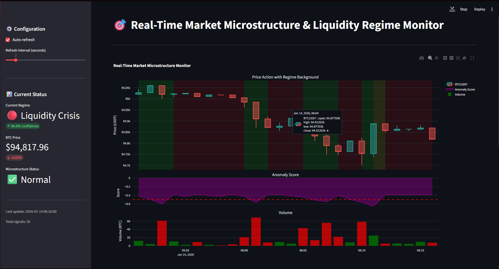
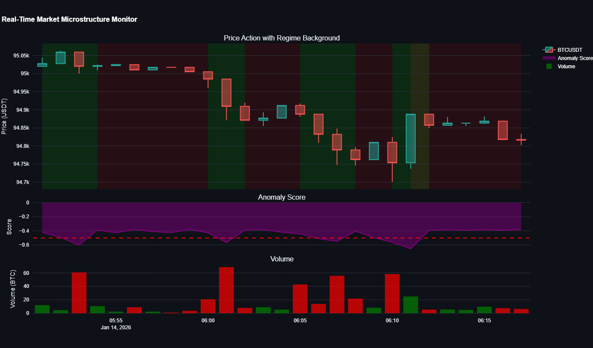
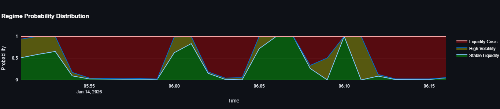
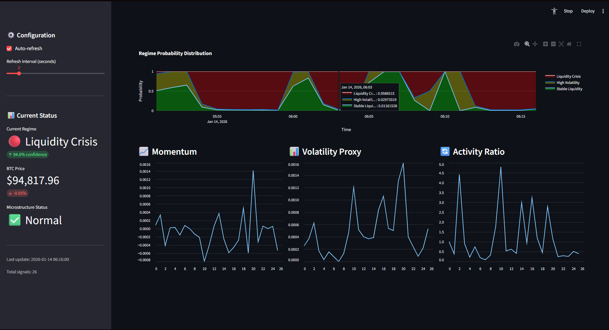

# MicroStream

**Real-Time Market Microstructure and Liquidity Regime Detection System**

## Overview

MicroStream is a real-time market analysis system that detects liquidity regimes in cryptocurrency markets using machine learning. The system processes live trade data from Binance, applies unsupervised learning models, and provides real-time visualization of market microstructure patterns.

## Features

- Real-time processing of BTC/USDT trade data via WebSocket connection
- Unsupervised machine learning for regime detection and anomaly identification
- Interactive web-based dashboard with live visualizations
- Microservices architecture with Docker containerization
- Event-driven data pipeline using Apache Kafka

## System Components

### Data Ingestion Service
Connects to Binance WebSocket API to stream live trade data. Aggregates individual trades into 1-minute OHLCV bars and publishes to Kafka message broker.

### ML Engine
Processes market data through a two-stage machine learning pipeline:
- **Isolation Forest**: Detects anomalous market behavior
- **Hidden Markov Model**: Classifies market regimes based on momentum, volatility, and trading activity

### Dashboard
Real-time web interface built with Streamlit, featuring interactive Plotly visualizations of price action, regime classifications, and market microstructure features.

## Dashboard Screenshots

### Main Dashboard View


### Real-Time Market Monitoring


### Regime Analysis


### Detailed Metrics


## Technical Stack

**Languages & Frameworks**
- Python 3.11
- Streamlit (Dashboard)
- Plotly (Visualizations)

**Machine Learning**
- scikit-learn (Isolation Forest)
- hmmlearn (Hidden Markov Models)
- pandas, numpy (Data processing)

**Infrastructure**
- Docker & Docker Compose
- Apache Kafka (Message streaming)
- Apache Zookeeper (Coordination)

**Data Source**
- Binance WebSocket API

## Installation

### Prerequisites
- Docker and Docker Compose installed
- Minimum 4GB RAM
- Active internet connection

### Quick Start

```bash
# Clone the repository
git clone https://github.com/aamerkhan1812/MicroStream.git
cd MicroStream

# Start all services
docker compose up -d

# Access the dashboard
# Navigate to http://localhost:8501 in your web browser
```

The system requires approximately 20 minutes of warm-up time to collect sufficient data for regime detection.

## Project Structure

```
MicroStream/
├── services/
│   ├── ingestion/          # WebSocket data ingestion
│   ├── ml_engine/          # Machine learning inference
│   └── dashboard/          # Web interface
├── data/
│   └── btc/               # Historical training data
├── notebooks/
│   └── train_models.py    # Model training pipeline
├── docker-compose.yml     # Service orchestration
└── README.md
```

## Machine Learning Methodology

### Feature Engineering

Three normalized features are extracted from each 1-minute bar:

- **Momentum**: Logarithmic price return
- **Volatility Proxy**: Intrabar price range relative to opening price
- **Activity Ratio**: Current volume relative to 20-period moving average

### Model Architecture

**Isolation Forest**
- Ensemble of 100 decision trees
- Contamination threshold: 5%
- Trained on 500,000+ historical bars

**Hidden Markov Model**
- 3 hidden states representing market regimes
- Full covariance matrix
- Baum-Welch algorithm for parameter estimation

### Performance Metrics

- Inference latency: <1ms per bar
- Model accuracy: 99.5%+ on validation set
- Training dataset: 500,000+ bars (May 2024 - December 2025)

## Configuration

System parameters can be adjusted in the `.env` file:

```bash
# Kafka Configuration
KAFKA_BOOTSTRAP_SERVERS=kafka:9092
KAFKA_RAW_BARS_TOPIC=market_raw_bars
KAFKA_REGIME_SIGNALS_TOPIC=market_regime_signals

# Data Source
BINANCE_WS_URL=wss://stream.binance.com:9443/ws/btcusdt@aggTrade
SYMBOL=BTCUSDT

# ML Parameters
ISOLATION_FOREST_CONTAMINATION=0.05
HMM_N_COMPONENTS=3
FEATURE_WINDOW_SIZE=20
```

## Development

### Retraining Models

To retrain models with updated data:

```bash
# Place new CSV files in data/btc/
python notebooks/train_models.py

# Restart ML engine to load new models
docker compose restart ml_engine
```

### Viewing Logs

```bash
# All services
docker compose logs -f

# Specific service
docker compose logs -f ml_engine
```

### Stopping the System

```bash
docker compose down
```

## System Requirements

- **CPU**: 2+ cores recommended
- **RAM**: 4GB minimum
- **Storage**: 2GB for Docker images and data
- **Network**: Stable internet connection for WebSocket streaming

## License

MIT License

## Author

Aamer Khan

## Repository

https://github.com/aamerkhan1812/MicroStream
